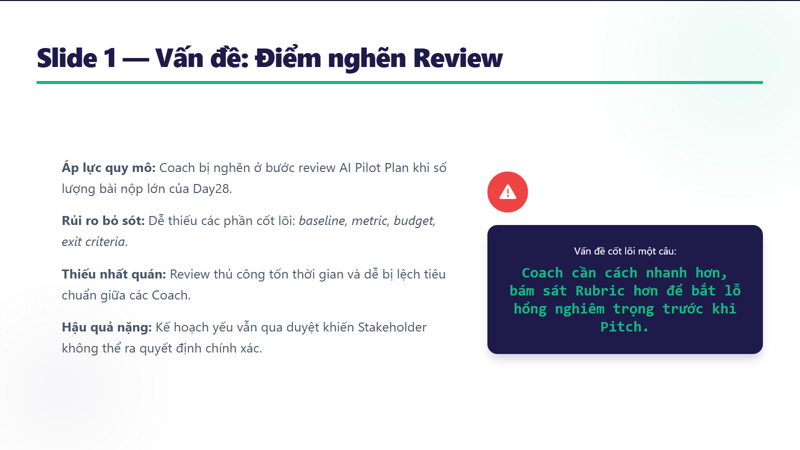
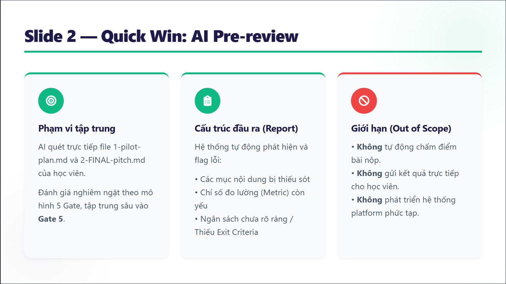
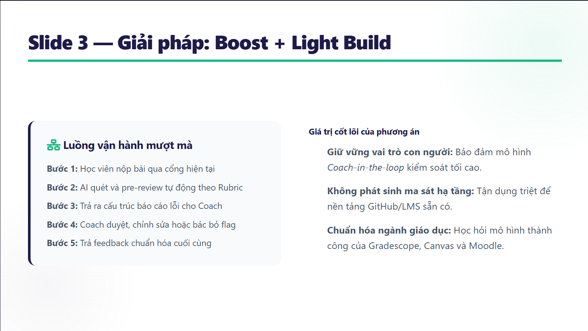
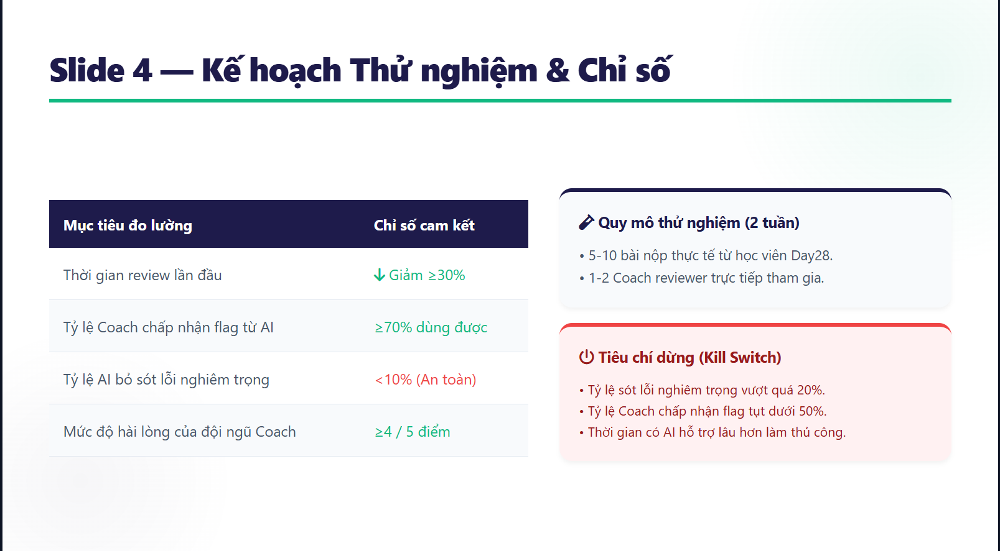
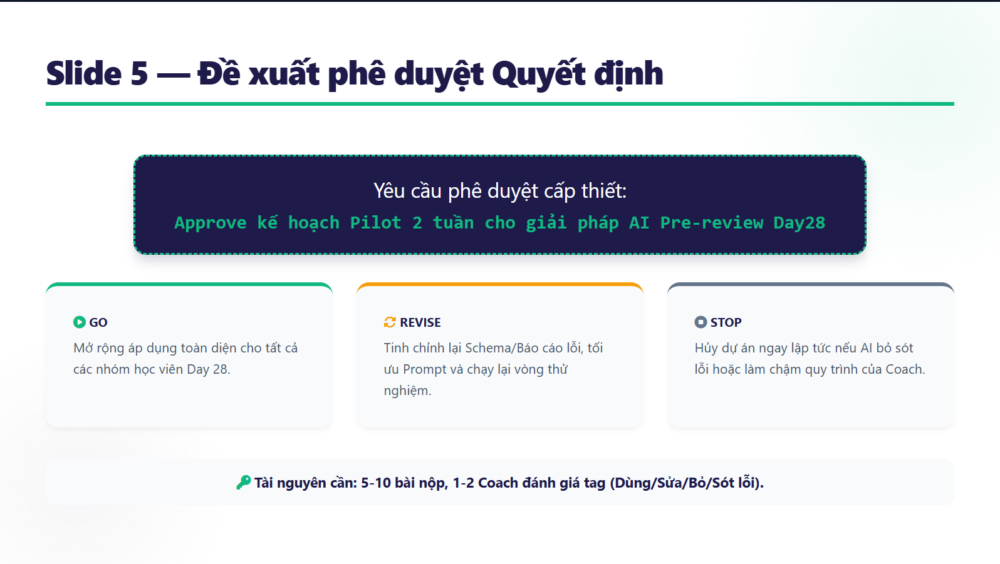

# FINAL · 5-slide Pitch + AI Support Log

## Slide 1 — Vấn đề



## Slide 2 — Quick Win



## Slide 3 — Giải pháp



## Slide 4 — Kế hoạch pilot



## Slide 5 — Xin quyết định



## 3 câu hỏi khó

| # | Câu hỏi | Câu trả lời chuẩn bị trước |
|---|---|---|
| 1 | Số liệu baseline lấy ở đâu? | Hiện baseline như 10-15 phút review và mục tiêu giảm 30% là giả định để thiết kế pilot, không dùng như fact. Tuần 1 sẽ đo thời gian review thủ công thật với coach trước khi kết luận. |
| 2 | Nếu AI bỏ sót lỗi nghiêm trọng thì sao? | AI không gửi feedback trực tiếp cho học viên. Coach duyệt bắt buộc. Nếu tỷ lệ AI bỏ sót lỗi nghiêm trọng >20% hoặc bỏ sót lỗi như exit criteria quá thường xuyên, pilot dừng. |
| 3 | Tại sao không dùng LMS/Gradescope/Canvas luôn? | Các tool đó mạnh về rubric workflow, nhưng pilot cần xử lý markdown Day28 + rubric Pilot Plan cụ thể. Vì vậy nhóm chọn Boost + Light Build trước; nếu hiệu quả, có thể tích hợp vào LMS/GitHub sau. |

## AI Support Log

Log này ghi trung thực cách nhóm dùng AI: AI hỗ trợ tách ý, draft, phản biện và tìm pattern tham khảo; con người chọn hướng cuối, kiểm nguồn, sửa giả định và chịu trách nhiệm nội dung nộp.

| Bước | Con người làm gì | AI làm gì | Kết quả sau khi người review |
|---|---|---|---|
| 1 | Nhóm chọn Track 06 và xác định người dùng chính là coach/TA, không phải học viên. | AI tách Track 06 thành nhiều use case nhỏ có thể pilot. | Nhóm bỏ hướng full auto-grading và dashboard vì quá rộng cho Day28. |
| 2 | Nhóm chọn tiêu chí chấm Quick Win: impact, feasibility, evidence nhanh, risk. | AI đề xuất bảng chấm điểm và giải thích vì sao từng use case mạnh/yếu. | Nhóm chọn **AI pre-review Pilot Plan + Exit Criteria** vì điểm cao nhất và rủi ro thấp hơn student-facing self-check. |
| 3 | Nhóm yêu cầu phải có nguồn thật nếu dùng claim về tool/rubric. | AI tìm pattern tương tự từ Gradescope, Canvas, Moodle và OpenAI Graders. | Nhóm chỉ giữ các nguồn có link cụ thể; các số chưa kiểm chứng được ghi là giả định. |
| 4 | Nhóm quyết định không auto-grade và không gửi AI feedback thẳng cho học viên. | AI draft solution flow: bài nộp → AI pre-review → coach dùng/sửa/bỏ → feedback cuối. | Nhóm thêm human-in-the-loop, quyền override của coach và phần các hướng không chọn. |
| 5 | Nhóm cần metric đủ rõ để stakeholder quyết định pilot. | AI đề xuất công thức tính: giảm thời gian review, tỷ lệ coach chấp nhận flag, tỷ lệ AI bỏ sót lỗi nghiêm trọng, satisfaction. | Nhóm chốt ngưỡng: giảm thời gian ≥30%, acceptance ≥70%, miss nghiêm trọng <10% để scale, >20% thì dừng. |
| 6 | Nhóm kiểm lại văn phong và tính nhất quán tiếng Việt. | AI rà heading, thuật ngữ và format file. | Nhóm giữ tiếng Việt làm chính, chỉ giữ thuật ngữ lab như Quick Win, Pilot Plan, AI Support Log, Build/Buy/Boost/Partner. |

Phần con người quyết định cuối:

- Chọn track và Quick Win cuối.
- Quyết định không làm auto-grading, không student-facing ở pilot đầu.
- Kiểm tra nguồn và loại bỏ claim không có căn cứ.
- Chọn ngưỡng metric hợp lý cho pilot nhỏ.
- Chịu trách nhiệm pitch và câu trả lời khi bị hỏi phản biện.

Phần AI hỗ trợ:

- Gợi ý cách tách use case.
- Draft bảng scoring và lý do.
- Gợi ý nguồn tham khảo/pattern đã có.
- Draft solution flow, pilot plan, risk và exit criteria.
- Rà lỗi format, ngôn ngữ và tính nhất quán giữa các file.

## Ghi chú cuối

Khuyến nghị cuối:

```text
Pilot AI pre-review như một trợ lý cho coach, không phải hệ thống auto-grading.
```

Vì sao bài nên qua 5 Gate:

- Gate 1: không pitch full platform; chỉ chọn Pilot Plan/Pitch pre-review.
- Gate 2: Quick Win có scoring và lý do.
- Gate 3: rõ user là coach/TA, workflow moment là trước feedback/pitch.
- Gate 4: solution có Build/Buy/Boost logic và visual flow.
- Gate 5: pilot có scope, timeline, budget, metrics, exit criteria và ask rõ.
